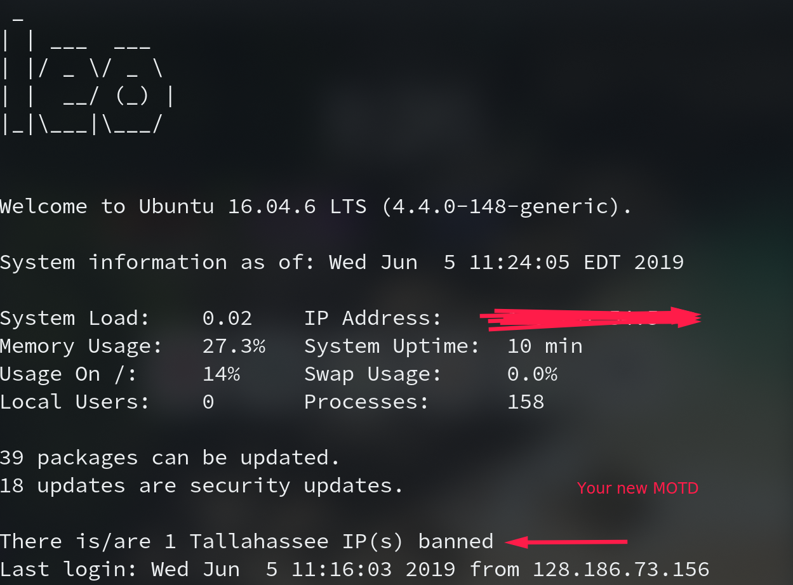

# Geo IP Ban Notifier 
## Description
This script, in combination with mindmap4.dat, will
allow the user to scan their fail2ban "f2b-sshd-perma" filter
and check banned IPs against a set city. If found, it will 
add the amount of banned IPs to the MOTD. Preset for Tallahasse, FSU.
## As A Service

This works as a systemd service, that restarts occasionally to re-populate the MOTD.

## Setup
Need to install and configure geolocation iplookup 

    sudo pacman -S geoip
    OR
    sudo apt-get install geoip-bin

    Example:
    geoiplookup 80.60.233.195

    Results in:
    GeoIP Country Edition: NL, Netherlands

Next, download the city repository from (http://geolite.maxmind.com/download/geoip/database/GeoLite2-City.tar.gz)

    wget http://geolite.maxmind.com/download/geoip/database/GeoLite2-City.tar.gz 
https://www.miyuru.lk/geoiplegacy to make .dat; user must get this and match path to 
    
    /usr/share/GeoIP/maxmind4.dat

Finally, run *setup.sh* in your terminal (can copy and paste all text):

    sudo nano setup.sh
    sudo chmod +x setup.sh
    sudo bash setup.sh
    .... after running ....
    sudo systemctl restart geo.service

# Results
Here is an example image of what your new MOTD will look like:

